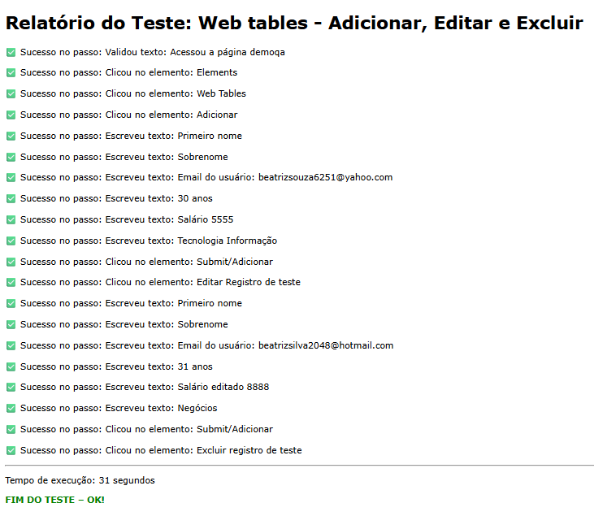

# DemoQAFrontWebTests

Projeto de automação de testes web utilizando Cypress

## Instalação do Cypress

Inserir no terminal da IDE:
npm install cypress --save-dev

## Executar os testes

Inserir no terminal:
npx cypress open

## Relatórios

Ao final de cada teste, é gerado um relatório HTML contendo o passo a passo da execução na pasta:

cypress/logs

Exemplo de relatório após executado teste:

## Arquivos de teste

O arquivo txt utilizado no teste `practiceform.cy.js` está localizado em:

cypress/file

## Drag and Drop

Para executar o teste `sortable.cy.js`, instalar o plugin:

Inserir no terminal:
npm install --save-dev @4tw/cypress-drag-drop

Adicionar o import abaixo no arquivo:

cypress/support/e2e.js (Adicionar nesse arquivo)

Adicionar o seguinte import:

javascript
import '@4tw/cypress-drag-drop'

